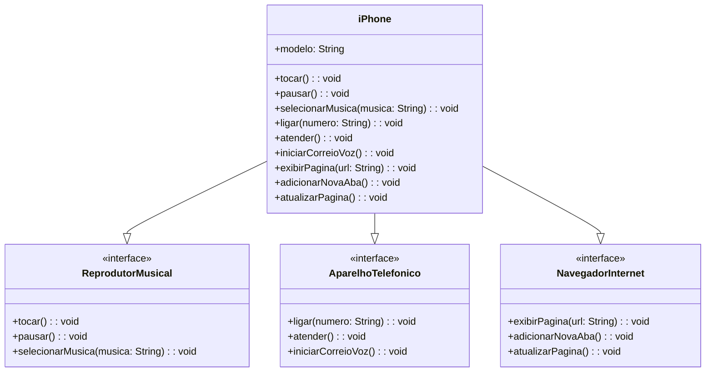

# 📱 Modelagem UML do iPhone

## 📊 Diagrama de Classes



*Figura 1: Diagrama de classes do iPhone mostrando as interfaces e suas implementações.*

## 💻 Implementação Java

### 📂 Estrutura do Projeto

```java
// Interface ReprodutorMusical.java
public interface ReprodutorMusical {
    void tocar();
    void pausar();
    void selecionarMusica(String musica);
}
```

```java
// Interface AparelhoTelefonico.java
public interface AparelhoTelefonico {
    void ligar(String numero);
    void atender();
    void iniciarCorreioVoz();
}
```

```java
// Interface NavegadorInternet.java
public interface NavegadorInternet {
    void exibirPagina(String url);
    void adicionarNovaAba();
    void atualizarPagina();
}
```

```java
// Classe iPhone.java
public class iPhone implements ReprodutorMusical, AparelhoTelefonico, NavegadorInternet {
    private String modelo;

    public iPhone(String modelo) {
        this.modelo = modelo;
    }

    // Implementação ReprodutorMusical
    @Override
    public void tocar() {
        System.out.println("Tocando música...");
    }

    @Override
    public void pausar() {
        System.out.println("Música pausada.");
    }

    @Override
    public void selecionarMusica(String musica) {
        System.out.println("Música selecionada: " + musica);
    }

    // Implementação AparelhoTelefonico
    @Override
    public void ligar(String numero) {
        System.out.println("Ligando para: " + numero);
    }

    @Override
    public void atender() {
        System.out.println("Chamada atendida.");
    }

    @Override
    public void iniciarCorreioVoz() {
        System.out.println("Correio de voz iniciado.");
    }

    // Implementação NavegadorInternet
    @Override
    public void exibirPagina(String url) {
        System.out.println("Exibindo página: " + url);
    }

    @Override
    public void adicionarNovaAba() {
        System.out.println("Nova aba adicionada.");
    }

    @Override
    public void atualizarPagina() {
        System.out.println("Página atualizada.");
    }
}
```

```java
// Classe Main.java
public class Main {
    public static void main(String[] args) {
        iPhone meuIphone = new iPhone("iPhone 15");

        // Testando funcionalidades
        meuIphone.tocar();
        meuIphone.selecionarMusica("Bohemian Rhapsody");
        meuIphone.ligar("123456789");
        meuIphone.exibirPagina("https://www.google.com");
    }
}
```

## 📚 Explicação do Código

### 🔧 Interfaces
1. **ReprodutorMusical**: Define os métodos básicos para controle de música
2. **AparelhoTelefonico**: Especifica as operações de telefonia
3. **NavegadorInternet**: Estabelece os comportamentos para navegação web

### 📱 Classe iPhone
- Implementa todas as três interfaces
- Mantém o encapsulamento com o atributo `modelo` privado
- Cada método imprime uma mensagem simulando a ação correspondente

### 🚀 Classe Main
Demonstra o uso das funcionalidades:
1. Controle de música
2. Operações telefônicas
3. Navegação na internet

## ⚙️ Como Executar

1. Crie um novo projeto Java
2. Adicione os arquivos acima em seu projeto
3. Compile e execute a classe `Main`

## 🏗️ Princípios de POO Aplicados

✅ **Abstração**: Através das interfaces  
✅ **Encapsulamento**: Atributo `modelo` privado  
✅ **Polimorfismo**: Implementação múltipla de interfaces  
✅ **Coesão**: Cada classe tem uma única responsabilidade  

---