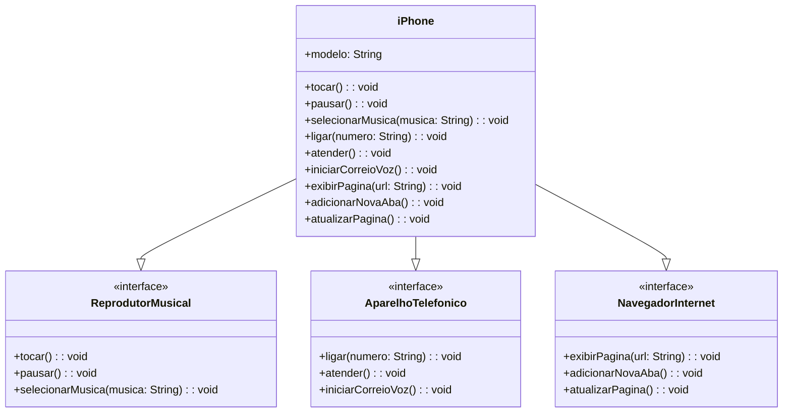

# Modelagem UML do iPhone

## Diagrama de Classes

```mermaid
classDiagram
    class iPhone {
        +modelo: String
        +tocar(): void
        +pausar(): void
        +selecionarMusica(musica: String): void
        +ligar(numero: String): void
        +atender(): void
        +iniciarCorreioVoz(): void
        +exibirPagina(url: String): void
        +adicionarNovaAba(): void
        +atualizarPagina(): void
    }

    class ReprodutorMusical {
        <<interface>>
        +tocar(): void
        +pausar(): void
        +selecionarMusica(musica: String): void
    }

    class AparelhoTelefonico {
        <<interface>>
        +ligar(numero: String): void
        +atender(): void
        +iniciarCorreioVoz(): void
    }

    class NavegadorInternet {
        <<interface>>
        +exibirPagina(url: String): void
        +adicionarNovaAba(): void
        +atualizarPagina(): void
    }

    iPhone --|> ReprodutorMusical
    iPhone --|> AparelhoTelefonico
    iPhone --|> NavegadorInternet
```
*Figura 1: Diagrama de classes do iPhone.*